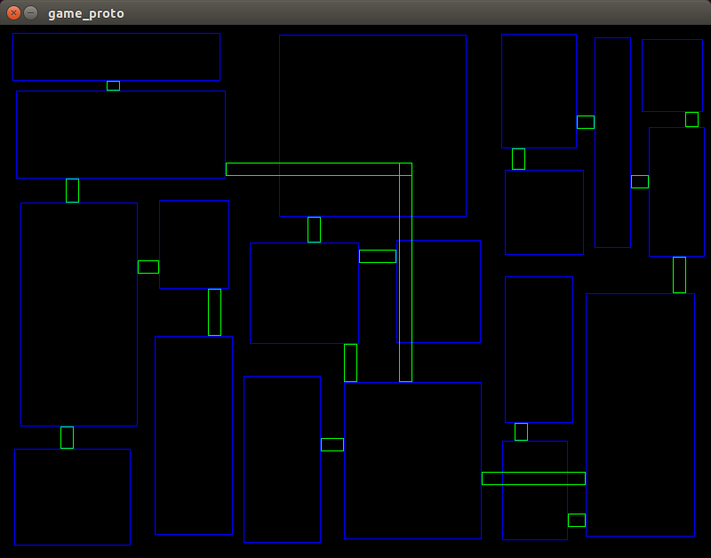

# Level generation algorithm

## Algorithm moved to [Dungeon Generator](https://github.com/Vinatorul/dungeon-generator-rs)

### About

This project is for presentation and debugging dungeon generation algorithm.
It works in three steps

 1. Workspace splitting to random rectangles with the help of binary tree
 2. In every rectangle generating a random room
 3. Coridors generating with the help of the binary tree, generated at the first step

For now you can customize generation with this constants (may be someday it will become crate with user-friendly
configuration, but not today):
 * `DN_MAX_DEEP` - levels of binary tree
 * `DN_ALLOW_FULL_FROM` - level of tree from which node can deny split
 * `DN_SPLIT_CHANCE_DEC` - split chance decreasment per tree level starting from DN_ALLOW_FULL_FROM
 * `DN_SPLIT_COEFF` - max splitting coefficient
 * `DN_DEFAULT_CHANCE` - default splitting chance
 * `DN_MIN_SP_SIZE` - minimum splittable size of subdungeon
 * `DN_CORIDOR_WIDTH` - constant width of corridors

## How it looks like

## Licence
This project is licensed under the MIT license. Please read the [LICENSE](https://github.com/Vinatorul/level_generator_proto/blob/master/LICENSE)
file in this repository for more information.
